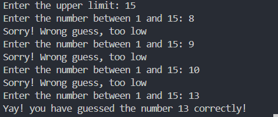
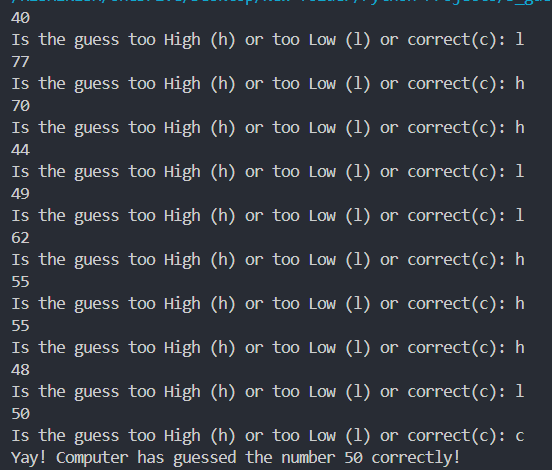

# Python-Projects
Learning Python by building projects 
 
Rishikesh 

# 1 MadLib-style YouTube Intro Generator 
- Project-1 1_madlib.py

The program collects input from the user—like their name, a YouTuber's name, and a video topic—and then generates a customized YouTube-style intro using that information. It’s simple, interactive, and a fun way to learn how user input and string formatting work.

---

### Output 

# 2 Guess the number through USER  
- Project-2 2_madlib.py

The Program makes the user guess a random number 
---

### Output 

# 3 Guess the number by Computer  
- Project-3 3_madlib.py

The Program makes the computer guess a random number 
---

### Output 

