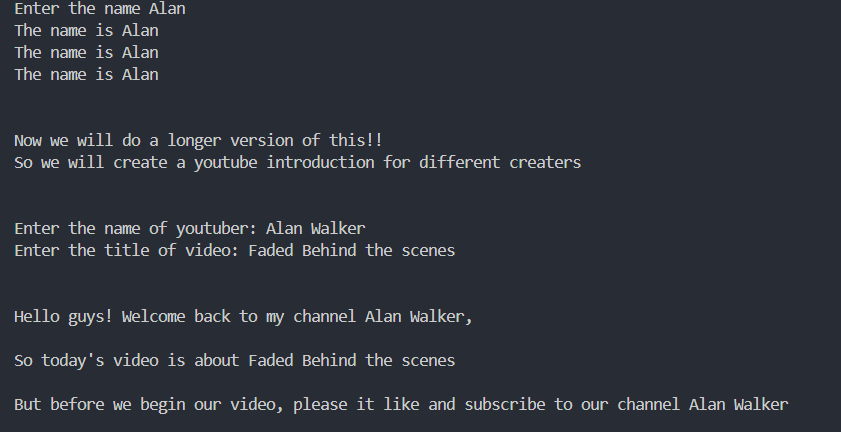

# Python-Projects
Learning Python by building projects 
 
Rishikesh 

# 🎬 MadLib-style YouTube Intro Generator

## 📚 What I Learned

- How to take input in Python using `input()`
- Three different ways to combine strings:
  - Using `+`
  - Using `.format()`
  - Using **f-strings**
- How to add line breaks and structure output using `\n`

---

## 💡 Project Description

The program collects input from the user—like their name, a YouTuber's name, and a video topic—and then generates a customized YouTube-style intro using that information. It’s simple, interactive, and a fun way to learn how user input and string formatting work.

---

## Output 

